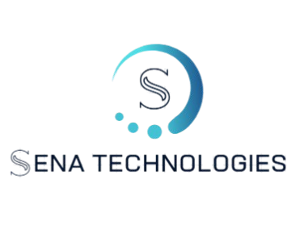

# 🚀 Sena Technologies - Website Oficial

<div align="center">



**Desenvolvimento Web e Aplicativos Mobile em Joinville-SC**

[](https://vercel.com/igor-senas-projects/v0-sena-technologies-website)
[](https://nextjs.org/)
[](https://www.typescriptlang.org/)
[](https://tailwindcss.com/)

[🌐 Ver Site](https://vercel.com/igor-senas-projects/v0-sena-technologies-website) · [📧 Contato](mailto:contato@senatechnologies.com.br) · [💼 Portfólio](#-portfólio)

</div>

---

## 📋 Sobre o Projeto

O site oficial da **Sena Technologies** é uma landing page moderna e responsiva, desenvolvida para apresentar nossos serviços de desenvolvimento web e aplicativos mobile em Joinville-SC e região.

### 🎯 Objetivos
- Apresentar serviços de forma profissional
- Gerar leads qualificados através de formulários otimizados
- Mostrar credibilidade através de portfólio e depoimentos
- Otimização SEO para Joinville-SC e Santa Catarina

---

## ✨ Funcionalidades

### 🏠 **Seções Principais**
- **Hero Section** - Apresentação impactante com CTAs
- **Sobre Nós** - História e valores da empresa
- **Localização** - Atendimento em Joinville-SC e região
- **Serviços** - Portfolio completo de soluções
- **Portfólio** - 10 projetos organizados por categorias
- **Depoimentos** - Feedback de clientes
- **Contato** - Formulário integrado com envio de emails

### 🎨 **Design & UX**
- Design moderno com gradientes e animações
- Totalmente responsivo (mobile-first)
- Animações suaves com hover effects
- Paleta de cores profissional (cyan/blue)
- Tipografia otimizada para leitura

### 🔧 **Funcionalidades Técnicas**
- Formulário de contato funcional
- Filtros interativos no portfólio
- Navegação suave entre seções
- Links diretos para WhatsApp
- Otimização de performance e SEO

---

## 🛠️ Tecnologias Utilizadas

### **Frontend**
- **[Next.js 15.2.4](https://nextjs.org/)** - Framework React com SSR
- **[TypeScript](https://www.typescriptlang.org/)** - Tipagem estática
- **[TailwindCSS](https://tailwindcss.com/)** - Framework CSS utilitário
- **[Lucide React](https://lucide.dev/)** - Biblioteca de ícones

### **UI Components**
- **[Radix UI](https://www.radix-ui.com/)** - Componentes acessíveis
- **[Shadcn/ui](https://ui.shadcn.com/)** - Sistema de design
- **[React Hook Form](https://react-hook-form.com/)** - Gerenciamento de formulários

### **Deploy & Performance**
- **[Vercel](https://vercel.com/)** - Hosting e CI/CD
- **Image Optimization** - Next.js Image component
- **Font Optimization** - Google Fonts otimizado

---

## 🚀 Como Executar

### **Pré-requisitos**
```bash
Node.js 18+ 
npm ou yarn
```

### **Instalação**
```bash
# Clonar o repositório
git clone https://github.com/igorpaes21/sena_technologies.git

# Entrar no diretório
cd sena_technologies

# Instalar dependências
npm install

# Executar em desenvolvimento
npm run dev
```

### **Scripts Disponíveis**
```bash
npm run dev      # Servidor de desenvolvimento
npm run build    # Build para produção
npm run start    # Servidor de produção
npm run lint     # Verificar código
```

---

## 📁 Estrutura do Projeto

```
sena_technologies/
├── app/                    # App Router (Next.js 13+)
│   ├── components/         # Componentes específicos
│   ├── globals.css         # Estilos globais
│   ├── layout.tsx          # Layout principal
│   ├── page.tsx            # Página inicial
│   └── sitemap.ts          # SEO sitemap
├── components/             # Componentes reutilizáveis
│   ├── ui/                 # Componentes UI base
│   ├── portfolio-section.tsx
│   └── theme-provider.tsx
├── lib/                    # Utilitários
├── public/                 # Assets estáticos
└── styles/                 # Estilos adicionais
```

---

## 🎨 Portfólio

### **Sites Institucionais & Landing Pages**
- 🍽️ **Restaurante Gourmet** - Landing page com cardápio digital
- ⚖️ **Silva & Associados** - Site institucional advocacia
- 💄 **Curso Beleza em Casa** - Landing page de conversão

### **Sistemas e Aplicações Web**
- 📅 **Agenda Fácil** - Sistema de agendamento
- 📊 **Sales Dashboard** - Painel de gestão de vendas
- ✅ **ToDoApp Pro** - Lista de tarefas moderna

### **E-commerce & Soluções Digitais**
- 💎 **Elegance Gems** - E-commerce de semijoias
- 🔧 **Serviços Já** - Marketplace local
- 🤖 **SmartBot** - Chatbot inteligente
- 💰 **FinControl** - Gestão financeira

---

## 🌍 SEO & Localização

### **Foco Regional**
- **Cidade Base:** Joinville-SC
- **Região:** Vale do Itajaí (Blumenau, Pomerode, Timbó)
- **Estado:** Santa Catarina completo

### **Palavras-chave Principais**
- desenvolvimento web Joinville
- criação de sites Joinville SC
- aplicativo mobile Joinville
- desenvolvimento web Santa Catarina

---

## 📈 Performance

### **Métricas Otimizadas**
- ⚡ **Core Web Vitals** - Pontuação alta no Lighthouse
- 🖼️ **Images** - Formato WebP otimizado
- 📱 **Mobile First** - Design responsivo
- 🚀 **Loading** - Lazy loading e code splitting

---

## 🤝 Contribuição

Este é um projeto da **Sena Technologies**. Para sugestões ou correções:

1. Faça um fork do projeto
2. Crie uma branch para sua feature (`git checkout -b feature/nova-feature`)
3. Commit suas mudanças (`git commit -m 'Add nova feature'`)
4. Push para a branch (`git push origin feature/nova-feature`)
5. Abra um Pull Request

---

## 📞 Contato

**Sena Technologies**
- 🌐 **Website:** [senatechnologies.com.br](https://senatechnologies.com.br)
- 📧 **Email:** contato@senatechnologies.com.br
- 📱 **WhatsApp:** [(47) 99999-9999](https://wa.me/5547999999999)
- 📍 **Localização:** Joinville-SC

---

## 📄 Licença

Este projeto é propriedade da **Sena Technologies**. Todos os direitos reservados.

---

<div align="center">

**Desenvolvido com ❤️ pela [Sena Technologies](https://senatechnologies.com.br)**

*Transformando ideias em soluções digitais desde 2024*

</div>
